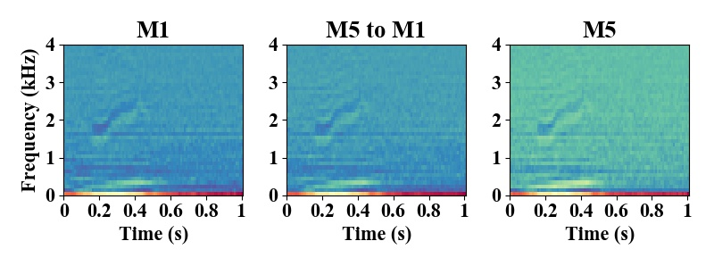

# pytorch-CycleGAN-for-audio
Enable audio translation using CycleGAN. This project is based from [pytorch-CycleGAN-and-pix2pix](https://github.com/junyanz/pytorch-CycleGAN-and-pix2pix/blob/master/README.md) and modified from [cyclegan_audio](https://github.com/vicpc00/cyclegan_audio). Credits are given to those projects.

# Usage
It does not directly translate audio in time domain. Instead, to make CycleGAN work for audio, we convert audio to corresponding features (MFCC or spectrogram) and save them as .npy file. Below script help to convert ".wav" files into corresponding features. The feature need to be saved to folder in a way that can be used for CycleGAN training (trainA,testA is splited in a 9:1 ratio)
```bash
# feature is MFCC, original audio is concatenated to 1-second long. Need to specify the source and destination in script
python ./scripts/save_MFCC_cyclegan_train.py
# feature is spectrogram, original audio is concatenated to 6-second long. Need to specify the source and destination in script
python ./scripts/save_spec_cyclegan_train.py
```
# Train and test
Train and test is similar to a normal CycleGAN. Change below "your_folder_name" and "your_model_name".
```bash
python train_spec.py --dataroot ./datasets/your_folder_name --name your_model_name --model cycle_gan --gpu_ids 0 --dataset_mode unaligned_spec
python test_spec.py --dataroot ./datasets/your_folder_name --name your_model_name --model cycle_gan
```
# Test Result
Below is a instance of translated result using [Google speech command dataset](http://download.tensorflow.org/data/speech_commands_v0.01.tar.gz).

